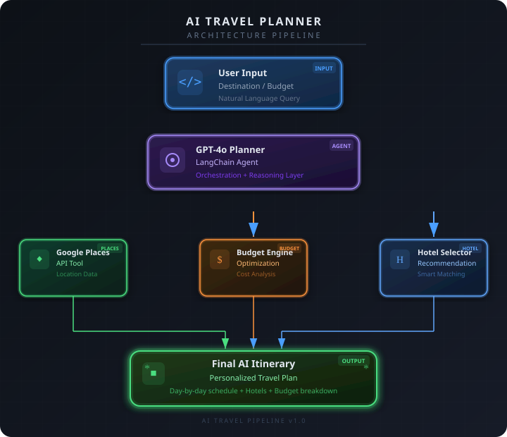
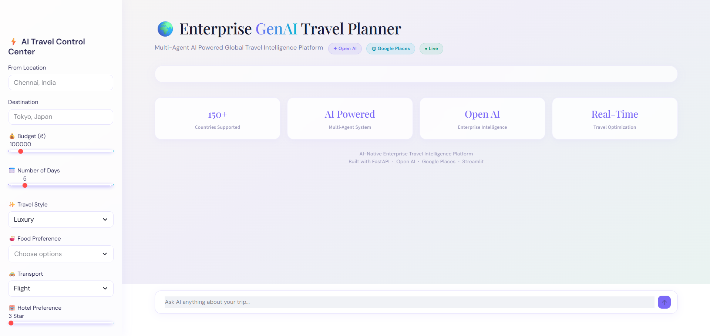

# Enterprise GenAI Travel Planner

An enterprise-grade GenAI-powered Travel Planning Platform that generates personalized multi-day itineraries using OpenAI GPT-4o, LangChain Agents, Google Places API, and intelligent budget optimization workflows.

---

# Project Overview

This project demonstrates how Large Language Models (LLMs) can be integrated with real-world APIs and intelligent reasoning systems to create a production-style AI Travel Assistant.

The platform dynamically generates:
- Personalized itineraries
- Budget-aware recommendations
- Tourist attraction suggestions
- Hotel recommendations
- Route-aware travel plans

for destinations across the world.

Unlike traditional static itinerary systems, this application uses:
- GPT-powered reasoning
- Tool calling
- Real-time travel data
- Prompt engineering
- Context-aware recommendations
- AI-based budget optimization

to provide adaptive and intelligent travel experiences.

---

# Key Features

## AI-Powered Itinerary Generation
Generates intelligent day-wise travel plans using OpenAI GPT-4o.

---

## Global Destination Support
Supports:
- Domestic trips
- International trips
- Solo travel
- Luxury travel
- Budget backpacking
- Family vacations

for any location worldwide.

---

## Google Places API Integration
Fetches:
- Tourist attractions
- Place details
- Ratings
- Addresses
- Nearby recommendations

using Google Maps Platform APIs.

---

## Dynamic Budget Optimization
AI intelligently allocates budget for:
- Hotels
- Food
- Transport
- Activities
- Emergency buffer

based on:
- destination
- travel style
- user preferences

---

## Personalized Recommendations
Supports:
- Food preferences
- Travel styles
- Transport preferences
- Budget constraints
- Multi-day planning

---

## Production-Level Architecture
Includes:
- Modular AI workflow
- Error handling
- Logging
- Extensible APIs
- Memory system
- Tool-based architecture

---

## Interactive Streamlit UI
Provides:
- Real-time itinerary generation
- Budget visualization
- User-friendly interaction
- Dynamic travel customization

---

# System Architecture

# Demo

